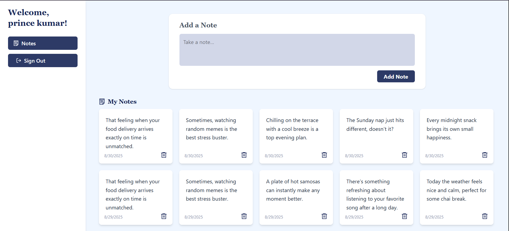
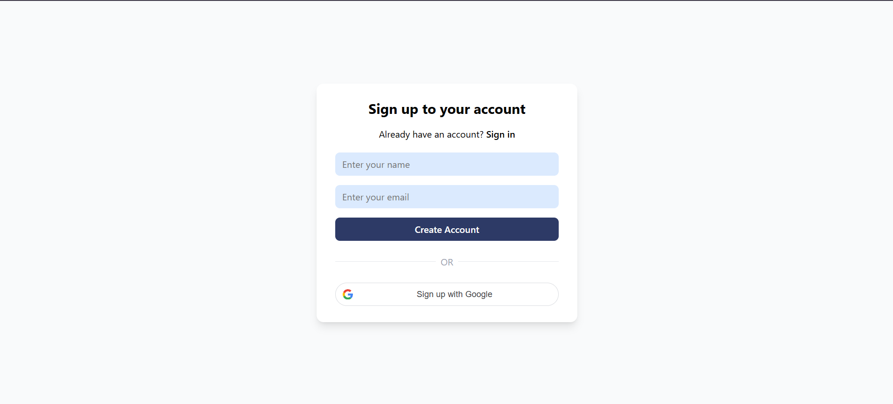
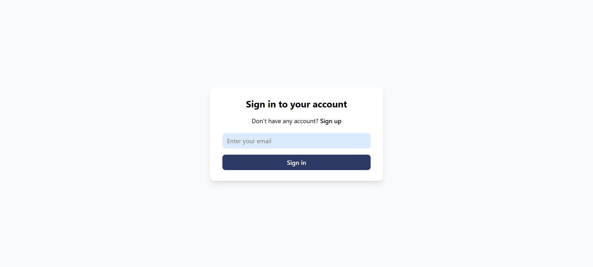
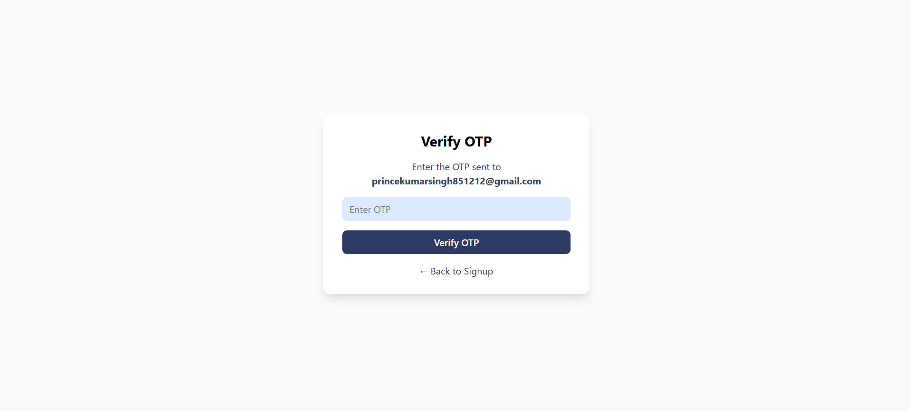

# Notes App — MERN Stack with Google/OTP Auth ✨

A full-stack notes-taking web application built using **Node.js**, **Express**, **MongoDB** for the backend, and **React** (Vite.js) for the frontend. This project features robust authentication with **Google OAuth** and **OTP-based signup/login with email**, secure JWT token management, and supports note creation & deletion.

> **Live Demo:** [Vercel Deployment Link](https://google-login-v853.vercel.app/)  
> **GitHub:** [@thegitaprince](https://github.com/thegitaprince/GoogleLogin)

---
## 🖼️ App Screenshots

- 
- 
- 
- 

---
## ✨ Features

- **Signup/Login via Email & OTP:**  
  Users sign up or log in with their email address, receive an OTP, and verify their account.
- **Google Login:**  
  One-tap authentication using Google OAuth.
- **JWT Token-Based Authentication:**  
  Access and refresh tokens for all protected routes; tokens sent securely via HTTP-only cookies.
- **Notes CRUD:**  
  - Create and delete your personal notes.  
  - Notes are user-specific and securely stored in MongoDB backend.
- **Toasts & UI Interactions:**  
  Friendly, real-time notifications via `react-hot-toast` for all actions (success/error).
- **Modern, Mobile-Friendly UI:**  
  - Built using React, Vite.js, and Tailwind CSS for a beautiful and responsive experience.
  - Clean codebase with Redux Toolkit for state management.

---

## 🏗️ Tech Stack

### Backend

- **Node.js** + **Express.js**  
  API server with RESTful routes; handles authentication, notes CRUD, JWT, and email integration.
- **MongoDB**  
  Data storage for users and notes.
- **Google OAuth (via @react-oauth/google)**  
  Secure Google authentication for users.
- **Resend**  
  Email service provider for sending OTPs.
- **JWT Token**  
  Authentication uses access and refresh tokens for session management.

#### Key Backend Libraries
- express
- mongoose
- jsonwebtoken
- bcryptjs
- dotenv
- resend (for OTP emails)
- @react-oauth/google (Google token verification)

### Frontend

- **React (19.1.0)** with **Vite.js**  
  Fast, modern UI and dev experience.
- **React Redux & Redux Toolkit**  
  State management and async thunks for API calls.
- **React Router DOM**  
  SPA navigation and route protection.
- **@react-oauth/google**  
  Easy integration for Google sign-in/login.
- **React Hot Toast**  
  Beautiful, minimal notifications with error and success messages for all user actions.
- **Axios**  
  Promise-based HTTP client for API communication.
- **Tailwind CSS**  
  Utility-first CSS for rapid, responsive styling.

---
